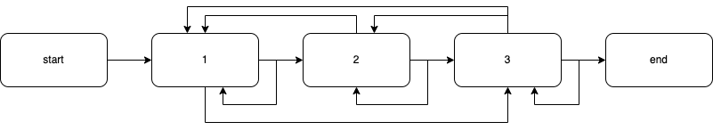

# dfa

确定有限状态自动机或确定有限自动机（deterministic finite automaton, DFA）

## 解决了什么问题
根据事先定义的配置信息,在每个节点状态下进行对应的状态转移


## demo



```
start -> 1

1 -> 1 
1 -> 2
1 -> 3

2 -> 1
2 -> 2
2 -> 3

3 -> 1 
3 -> 2 
3 -> 1
3 -> end

start 没有入度,因此为初态,所有状态的起始位置
end 没有出度,因此为终态,所有状态的终止位置
```
```go
// config meta.yaml 

func main() {
	config, err := ioutil.ReadFile("./meta.yaml")
	if err != nil {
		panic("read meta.yaml error")
	}

	dfa, err := NewDfa(string(config))
	if err != nil {
		panic("new dfa error")
	}
	s := NewStatus(dfa)

	s.Peek() // 查看当前状态下可转移的选项
	
	s.Transfer("1") // 转移到状态1
}

```
